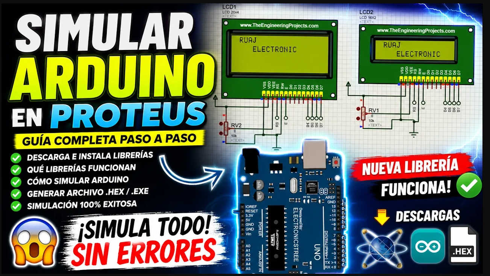

# ⚡ GUÍA DE INSTALACIÓN PROTEUS — RUAJ ELECTRIC

Guía paso a paso para dejar **Proteus** listo para simular: instalar librerías externas, simular **Arduino UNO** y cargar el archivo **.HEX** desde el IDE de Arduino.

> ⚠️ **Importante:** Proteus es un software comercial de **Labcenter Electronics**. En este repositorio **no se comparten instaladores ni cracks**. Descárgalo desde la página oficial (versión demo o con licencia) o con la licencia educativa de tu institución.

---

## 📋 Contenido

1. [Antes de empezar](#1️⃣-antes-de-empezar)
2. [Instalar librerías en Proteus](#2️⃣-instalar-librerías-en-proteus)
3. [Instalar el IDE de Arduino](#3️⃣-instalar-el-ide-de-arduino)
4. [Simular una LCD con Arduino](#4️⃣-simular-una-lcd-con-arduino)
5. [Cómo obtener el archivo .HEX](#5️⃣-cómo-obtener-el-archivo-hex)
6. [Errores comunes](#6️⃣-errores-comunes)
7. [Links usados en el video](#🔗-links-usados-en-el-video)

---

## 1️⃣ Antes de empezar

- Deja Proteus **en inglés**. No instales el pack en español: los menús y las librerías externas están pensados para la versión en inglés y el pack suele dar problemas.
- Ten instalado **WinRAR** (o 7-Zip). Las librerías vienen en `.rar` con contraseña y el explorador de Windows a veces da error al abrirlas.

---

## 2️⃣ Instalar librerías en Proteus

**Fuente recomendada:** Electronics Tree — tiene librerías simulables de Arduino, sensores (pulso cardíaco, vapor, etc.), módulos, ventiladores y más. Cada página trae el ejemplo de conexión y un código base.

**Pasos:**

1. Entra a la página de la librería que necesitas y dale **Download**.
2. Clic derecho sobre el `.rar` → **Mostrar más opciones** → **Extraer aquí** (con WinRAR).
3. Te pedirá una **contraseña**: aparece en la misma página de descarga y es la misma para todas las librerías del sitio.
4. Abre la carpeta descomprimida → entra a **`LIB`** → copia los archivos que hay ahí (`.LIB` / `.IDX`).
5. Busca la carpeta de librerías de Proteus:
   - Clic derecho al ícono de Proteus del escritorio → **Abrir ubicación del archivo**.
   - Retrocede hasta la carpeta **Labcenter Electronics** → **Proteus 8 Professional** → **DATA** → **LIBRARY**.
6. **Pega** los archivos ahí. Si Windows pregunta por reemplazar, es porque ya la tenías.
7. Abre Proteus → **New Project** → *Next, Next, Next, Finish*.
8. Presiona **P** (Pick Devices) y busca el componente. Ejemplo: el Arduino de Electronics Tree aparece en **Sensors and Modules** buscándolo como **UNO**.

> 📁 Rutas típicas de la carpeta LIBRARY (depende de la versión e instalación):
> - `C:\Program Files (x86)\Labcenter Electronics\Proteus 8 Professional\DATA\LIBRARY`
> - `C:\ProgramData\Labcenter Electronics\Proteus 8 Professional\LIBRARY` *(carpeta oculta)*
>
> Si pegas la librería en una y no aparece en Proteus, prueba en la otra.

---

## 3️⃣ Instalar el IDE de Arduino

1. Busca **"Arduino download"** y entra a la página oficial (arduino.cc).
2. Descarga la versión para tu sistema operativo (Windows / Mac / Linux) e instálala normal.
3. Para ponerlo en español: **File → Preferences → Language → Español**.
4. Selecciona la placa: **Herramientas → Placa → Arduino UNO**.
   *No necesitas un Arduino físico* para simular.

---

## 4️⃣ Simular una LCD con Arduino

1. Descarga la **Nueva Biblioteca LCD para Proteus** (link abajo). Este archivo **no tiene contraseña**.
2. Descomprime. Copia los archivos de librería a la carpeta **LIBRARY** de Proteus (igual que en el paso 2).
3. Abre el código del ejemplo (`.ino`) → se abre en el IDE de Arduino.
4. Dale **Verificar** ✔️ (no "Subir", porque no hay placa conectada).
5. Abre el archivo de Proteus del ejemplo.
   - Si sale un error con el Arduino del esquema, es porque ese modelo no está en tu librería. Toma un **pantallazo de las conexiones**, borra ese Arduino (*Delete Object*), pon el Arduino UNO que sí instalaste y vuelve a conectar los pines igual.
6. Doble clic al Arduino → en **Program File** pega la ruta del **.HEX** (ver paso 5) → **OK**.
7. Dale **Play ▶** (abajo a la izquierda) y la LCD muestra el mensaje.

> 🔁 Cada vez que cambies el código: **Verificar** de nuevo y volver a cargar el .HEX en Proteus.

---

## 5️⃣ Cómo obtener el archivo .HEX

**Opción A — Exportar binario (la más fácil)**
**Programa → Exportar binarios compilados**. El `.hex` queda dentro de la carpeta del sketch. Usa el que **no** dice `with_bootloader`.

**Opción B — Desde la salida de compilación**
1. **Archivo → Preferencias** → marca ✅ **Mostrar salida detallada durante: compilación**.
2. Dale **Verificar**.
3. En la consola de abajo busca la última línea que termine en **`.hex`** y copia la ruta desde `C:\` hasta `.hex`.
4. Pégala en **Program File** de Proteus y **borra las comillas** si se copiaron.

---

## 6️⃣ Errores comunes

| Problema | Causa probable | Solución |
|---|---|---|
| El `.rar` no abre o da error | Se abrió con el explorador de Windows | Abrir con WinRAR → Extraer aquí |
| Pide contraseña | Las librerías de Electronics Tree vienen protegidas | La contraseña está en la página de descarga |
| No aparece el componente al presionar **P** | Librería pegada en la carpeta equivocada o Proteus estaba abierto | Revisar ruta LIBRARY y reiniciar Proteus |
| Error al abrir el ejemplo de Proteus | El Arduino del esquema no está en tu librería | Reemplazarlo por el Arduino UNO instalado y reconectar pines |
| La simulación no hace nada | No se cargó el `.hex` o la ruta tiene comillas | Revisar **Program File** |
| Cambié el código y no se refleja | Proteus sigue usando el `.hex` viejo | Verificar de nuevo y volver a cargar el `.hex` |

> ⚠️ Una simulación no siempre se comporta igual que el circuito físico. Úsala para aprender y validar la lógica, pero prueba en real antes de instalar.

---

## 🔗 Links usados en el video

- **Electronics Tree — Librerías para Proteus:** https://electronicstree.com/ecg-signal-generator-for-proteus/
- **Nueva Biblioteca LCD para Proteus:** https://sites.google.com/view/matesislovers/proteus/nuevas-bibliotecas-proteus-para-estudiantes-de-ingenier%C3%ADa/nueva-biblioteca-lcd-para-proteus
- **Arduino IDE (oficial):** https://www.arduino.cc/en/software

Las librerías son de sus respectivos autores. Aquí solo enlazo a las fuentes originales.

---

## 📁 Otros repositorios del canal

- [CURSO-CADE-SIMU](https://github.com/ruajelectric-dotcom/CURSO-CADE-SIMU) — material del curso completo de CADe SIMU
- [MATERIAL-DE-APOYO](https://github.com/ruajelectric-dotcom/MATERIAL-DE-APOYO) — manuales recomendados
- [musica-libre-ruaj](https://github.com/ruajelectric-dotcom/musica-libre-ruaj) — música libre CC0 para creadores

## 🔗 Sígueme

- 🎥 YouTube: [RUAJ ELECTRIC](https://www.youtube.com/playlist?list=PL12Fo7Tlkoigvi0rdW3g-1iNB54jVpZp-)
- 📱 TikTok: [@ruaj.electric](https://www.tiktok.com/@ruaj.electric)
